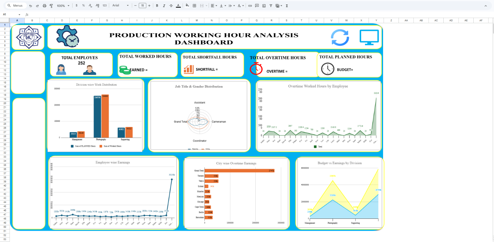

# Workforce Analytics Dashboard

## Project Overview
An interactive Excel dashboard developed to analyze employee productivity, working hours, overtime performance, workforce distribution, and earnings.

## Key Features
- Employee Productivity Analysis
- Overtime Tracking
- Workforce Distribution Analysis
- Earnings and Budget Monitoring
- Interactive Slicers and KPI Cards

## Tools Used
- Microsoft Excel
- Pivot Tables
- Pivot Charts
- Power Query
- Data Visualization

## Dashboard KPIs
- Total Employees
- Total Worked Hours
- Total Planned Hours
- Total Overtime Hours
- Total Shortfall Hours
- Earned Amount
- Overtime Earnings
- Budget Amount

## Dashboard Preview

## Project Files
- Dashboard.xlsx
- Dataset.xlsx
- Report.pdf

## Business Insights
- Workforce productivity monitoring
- Overtime trend analysis
- Budget vs Earnings comparison
- Data-driven decision making

## Author
Pranav Ugale